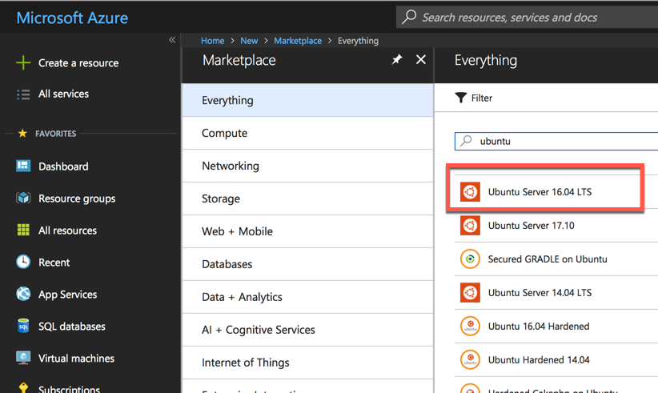

# Create and connect to a Linux lab VM in Azure
In this lab we will create a virtual machine and open an SSH connection to it. Before we can create a virtual machine, we need to create the public and private keys needed to connect to it.

## Create a public and private key that will be used to connect to SSH
1. Download and run __PuTTYgen__ from the following location:  
http://www.chiark.greenend.org.uk/~sgtatham/putty/download.html
1. Create a public and private key by opening puttygen and clicking the __Generate__ button show with __marker 1__ in the image, and following the instructions.

1. Once the key has been generated save it to the local disk by clicking the __Save private key__ button and selecting a location. You can provide a passphrase for some additional protection of this key if you like.
1. Copy the public key to the clipboard and use this when SSH public key when creating your VM.

## Create a Linux virtual machine in Azure
1. Open the Azure portal and create a new Ubuntu VM  

1. Configure the VM with the name __docker-lab__ to use __HDD__ disk type with a username of __docker__ and enter your __SSH public key__  

1. Select the __A1 Standard__ Size  

1. Accept the defaults in the Settings and Summary, then create a VM.

## Connect to the virtual machine with putty

1. Download and run __putty__ from the following location: http://www.chiark.greenend.org.uk/~sgtatham/putty/download.html
1. Fill in the host name or IP address of the VM:

1. Click __Connection > SSH > Auth__ tab. Browse to and select your private key:

1. Click __Open__ to connect to your virtual machine
