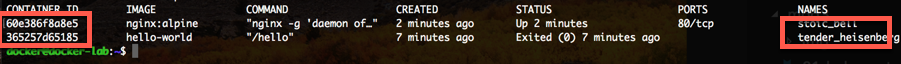
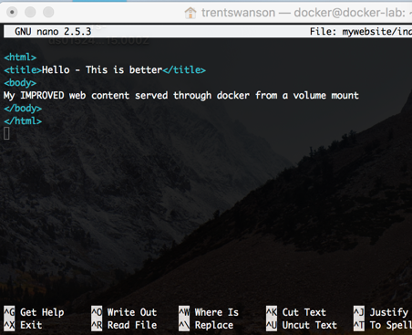

# Introduction to Docker
In this lab you will install docker on a linux VM and begin exploring the Docker commands.

## Install Docker on a Linux VM
1. Establish an SSH connection to the Docker lab Virtual Machine (VM)
1. A docker installation scrtip can be found at https://get.docker.com. Run the following command to download a docker installation script to the VM.   `curl -fsSL get.docker.com -o get-docker.sh`
1. Run the following command to begin installing docker   `sh get-docker.sh`
1. After docker is installed you will need to use `sudo` when executing command. Enter the following to reconfigure permissions in order to avoid that.  `sudo usermod -aG docker labuser`
1. Close the SSH connection and reconnet.
1. Run the following command to get Docker version information.   'docker version'
1. Run the following command to get detailed information about the Docker installation.   `docker info`

## Create and run a Docker containers
In this section we will run some docker containers. All of these commands will be run in the terminal window with the SSH connection to the lab machine.
1. Enter the following command to pull down a docker contianer from the docker registry and run it.  
`docker run hello-world` 
This command just pulled an image from the docker registry, created a container with that image, ran it, and exited
1. When running applications like web applications or databases we generally want to let them run, and we often want to let them run in the background. Enter the following command in the terminal to start an NGINX container. 
`docker run -d nginx:alpine`
1. An Nginx container started in the background and we received an id to that container. Run the following command to view the list of running containers. 
`docker ps` 
To view a list of the running and stopped containers run the followig command. 
`docker ps -a`
1. Now lets clean those containers up with the following commands. We can remove contianers with the `docker rm` command and either the first few characters in the __CONTAINER ID__ or the __CONTAINER NAME__. 
 
If a container is running like the nginx one, we will also need to use the `-f` flag with the `docker rm command`, or the `docker stop command to first stop it`. Now using the `docker rm` command remove the running containers 
`docker rm {ID|NAME}` 
Ensure all of the containers are cleaned up by using the `docker ps -a` command before moving to the next step
1. Let's create a new NGINX web server container, only we will create it a bit differently. Run the following command to create a new NGINX container.  
`docker run --name mywebapp -d --restart always -p 8080:80 nginx:1.13-alpine` 
__Note:__ This will create a docker container with a specific name in the background, and expose port 80 of the container to port 8080 on the host. If the application crashes docker will always restart the container. The previous time we started an NGINX container we were unable to connect to it from the host system.
1. Run the following command to connect to the web application, and view the ouptut. 
`curl localhost:8080`
1. The container is running in the background, but we can run applications inside the scope of this container namespace using the `docker exec` command. Enter the comman `docker exec mywebapp ls` to run the `ls` command in the `mywebapp` container. You should see a directory listing from the container.
1. The `-it` flags can be used with the `docker run` and the `docker exec` commands to connect to a container with terminal access.  Run the following command to start a sh process in the running container namespace and connet the terminal.  
`docker exec -it mywebapp sh`
1. Note the change in the command prompt, you should see a `/ #`. In the command type `hostname` to view the hostname of the container.  Type `ps` to view the processes running in the container namespace. Now... type `kill 1` to kill the process with the process id of `1`. You noticed the shell exited, because when process __1__ of a container exits the container stops. If we run `docker ps` from the host system we can see the container is still running. This is because we instructed docker to always restart this container if it is stopped.

## Explore Docker
Using our new Docker skills complete some challenges that will help us further expore Docker.

1. __Challenge:__ Figure out how to view the logs (Console History) for the running container.
1. __Challenge:__ Figure out how to dump all of the details of a container. Hint: You should `inspect` the contianer.
1. __Challenge:__ Figure out how to display running processes for a container without using the `exec` command.
1. __Advanced Challenge:__ Figure out how to run the `hello-world` container so that the container is cleaned up and removed after it completes. If you remember, after we ran it last time we saw the stopped container using the `docker ps -a` command.
1. __Advanced Challenge:__ Figure out how to copy the `/etc/nginx/nginx.conf` file from the container to the host system.

## Introduction to Docker volumes
In this section we will mount a container volume to a path in the host system.
1. Let's start with creating a directory on the host system by running the command `mkdir mywebsite` and then put a little content into the directory with the following command.  
`echo "My web content served through docker from a volume mount" > ./mywebsite/index.html`
1. Now let's start an Nginx web server to serve our new static web page, using the following command. 
`docker run --name myweb -v$(pwd)/mywebsite:/usr/share/nginx/html:ro -d -p 8080:80 nginx:alpine`  
Note that the `$(pwd)` part of this command just runs a subshell to get the current directory.
1. Run `curl localhost:8080` to view the content we created.
1. Edit the content with the command, `nano ./mywebsite/index.html` like below, and when complete enter `CTRL+X` to exit and then `y` to save the changes in the butter, and `ENTER` to accept the current path.

1. Run `curl localhost:8080` to view the updated web content from the web server.

## Working with Docker images
Up to this point we have been using existing images to create containers. In this section we will learn how to create and manage images.

1. Run the `docker images` command to view a list of Docker images on the host system.
1. Run the `docker rmi hello-world:latest` to remove the hello-world image from the local cache, then run `docker images` again to see that it's been deleted.
1. Create a new docker build file using the following command. `echo -e "FROM nginx:alpine \nCOPY mywebsite /usr/share/nginx/html" > dockerfile`
1. Run the following command to build a docker image. `docker build -t myimage:1 .` Note the dot at the end of this command. That's important becaue it's used to send the context to docker build.
1. Run the `docker images` command and notice we have a new image.
1. We can create a container from our image using the following command. `docker run -d -p 8081:80 myimage:1`
1. Now using the command `curl localhost:8081` we can see our content, only this time the content is part of the docker image and not being served from the host system.
1. You can edit the index.html file in the mywebapp folder and notice it does not change because it's inside the container.

### Image challenge
Using the skills you learned, stop and remove the container then edit the index.html content in the mywebsite folder and build a version 2 image of that container, then run it.

__Note:__ You can use the `docker cp` command to update the file in a running container as well, but when recreating that container from the image it would revert back to the image. You can also use the `docker exec` command to manipulate file inside a running container.
